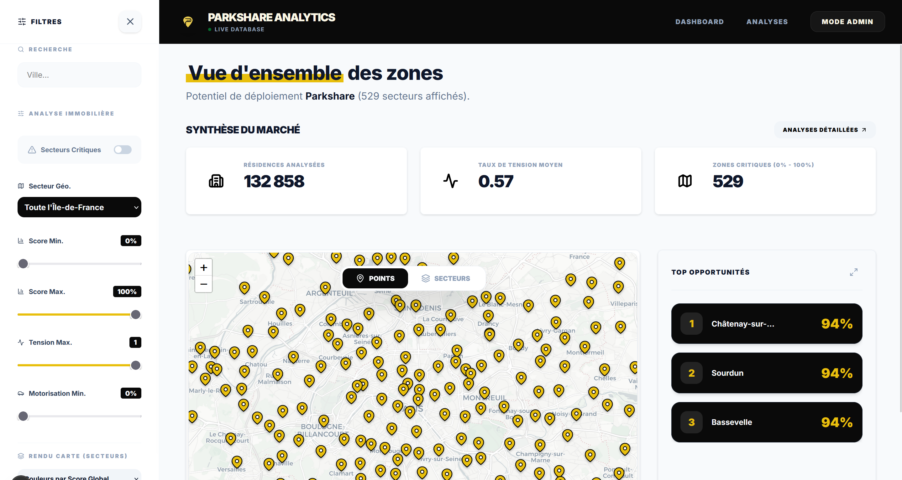
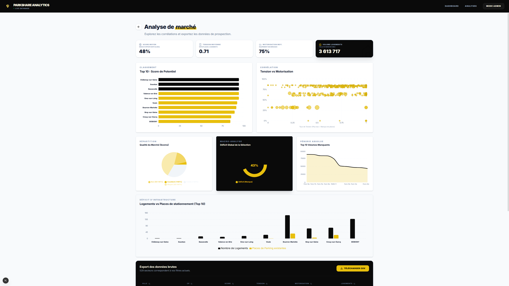

# 🚗 Parkshare Analytics - Dashboard de Prospection

Bienvenue sur le dépôt de l'application **Parkshare Analytics**, développée dans le cadre du Challenge 48h Parkshare. Ce tableau de bord interactif permet aux équipes commerciales d'identifier visuellement et statistiquement les zones géographiques (Île-de-France) présentant le plus fort potentiel pour le déploiement de notre solution de partage de parkings.

## 📸 Aperçu de l'interface


*Vue principale : Carte interactive, KPIs globaux et Top Opportunités.*


*Centre d'analyse : Graphiques de corrélation, macro-déficit et export CSV.*

---

## ✨ Fonctionnalités Principales

- **🗺️ Cartographie Interactive (Leaflet)** : Visualisation géographique avec deux modes (Points d'intérêt ou Rendu par Secteurs/Communes).
- **📊 Filtres Croisés Dynamiques** : Filtrage en temps réel par Score de potentiel, Taux de tension, Taux de motorisation et zone géographique (Département/Ville).
- **📈 Centre d'Analyse (Recharts)** : Graphiques interactifs (Bar charts, Scatter plots, Pie charts, Area charts) pour analyser les corrélations (Tension vs Motorisation) et les déficits macroscopiques.
- **💾 Export de Données** : Génération et téléchargement à la volée de fichiers CSV reprenant les données filtrées pour l'équipe commerciale.
- **⚡ Architecture Moderne** : Rendu hybride (Server/Client) avec Next.js pour des performances optimales.

---

## 🛠️ Stack Technique

- **Framework** : Next.js 14 (App Router) / React
- **Stylisation** : Tailwind CSS / Lucide Icons
- **Cartographie** : React-Leaflet / Leaflet.js
- **Visualisation de données** : Recharts
- **Base de données** : SQLite (via `sqlite` et `sqlite3`)
- **Langage** : TypeScript

---

## 🚀 Instructions d'Installation et d'Utilisation

### Prérequis
- Node.js (version 18 ou supérieure)
- NPM ou Yarn
- Le fichier de base de données SQLite fourni par l'équipe Data (`parkshare.db`).

> **⚠️ Note importante concernant la Base de Données :**
> En raison des limites de taille de fichier sur GitHub, la base de données SQLite (`parkshare.db`) présente sur ce dépôt n'a été poussée que **partiellement**. Les tables contenant les données brutes sont limitées aux 100 premières lignes pour servir d'exemple de structure et de typage. Pour exploiter le dashboard avec l'intégralité des données réelles de l'Île-de-France, vous devez générer la base complète via le pipeline du dossier `/data`.

### Étape 1 : Cloner et installer
```bash
# Cloner le dépôt
git clone [https://github.com/LucasGYnov/48h_challenge_PARKSHARE.git](https://github.com/LucasGYnov/48h_challenge_PARKSHARE.git)
cd 48h_challenge_PARKSHARE/app

# Installer les dépendances
npm install
# ou
yarn install